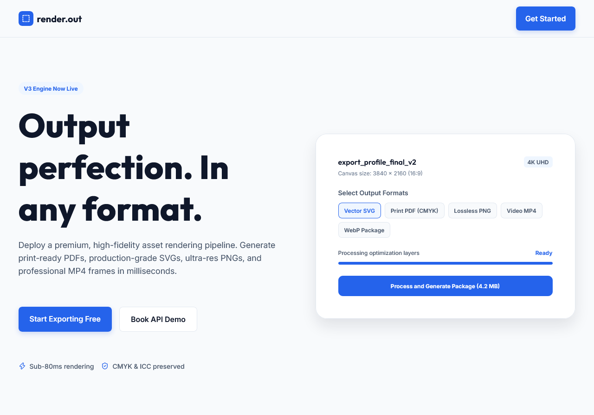

# render.out

A landing page for a fictional high-fidelity asset rendering service. Built as a portfolio project to showcase modern SvelteKit development.

**Live demo:** [render-out.vercel.app](https://render-out.vercel.app)



## Stack

- **SvelteKit** — SSR, file-based routing
- **Svelte 5** — runes (`$state`, `$props`)
- **TypeScript** — strict mode
- **Tailwind CSS 4** — utility-first styling
- **Bits UI** — accessible headless components
- **Lucide** — icons

## Run locally

```bash
git clone https://github.com/murfixtap/render-out.git
cd render-out
pnpm install
pnpm dev
```

Open [http://localhost:5173](http://localhost:5173).

## Scripts

| Command        | Description              |
| -------------- | ------------------------ |
| `pnpm dev`     | Dev server with HMR      |
| `pnpm build`   | Production build         |
| `pnpm preview` | Preview production build |
| `pnpm check`   | Type check               |
| `pnpm lint`    | Prettier + ESLint        |
| `pnpm format`  | Auto-format              |

## Structure

```
src/
├── lib/
│   ├── assets/          # Logos, images
│   ├── components/
│   │   ├── layout/      # Header, Footer, Logo
│   │   ├── sections/    # Hero, Features, Pricing, ...
│   │   └── ui/          # Reusable primitives
│   └── index.ts         # Barrel export
└── routes/              # SvelteKit routes
```

## Notes

All product names, testimonials, and pricing are fictional. Built for demonstration purposes only.
